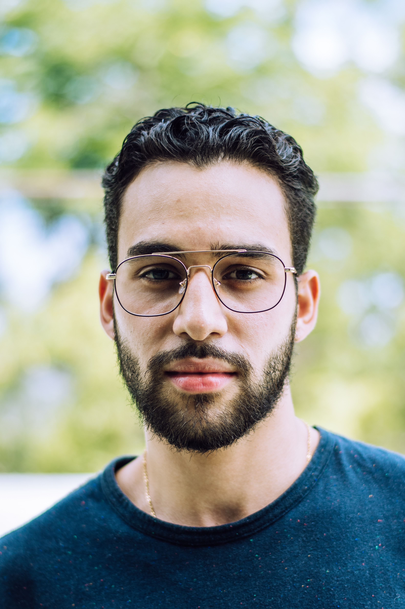

# Face-Manipulation
Manipulate size of the nose and the left eye

You can download the pre-trained model file from <a href="https://github.com/italojs/facial-landmarks-recognition/blob/master/shape_predictor_68_face_landmarks.dat">Here</a>. (put the file in the model directory)

# Run
> python3 app.py --image face.jpg --threshold -20

# Result

-----------------------------------------------
<a href="https://unsplash.com/photos/KbBztc5PTC8">Image Source</a>
